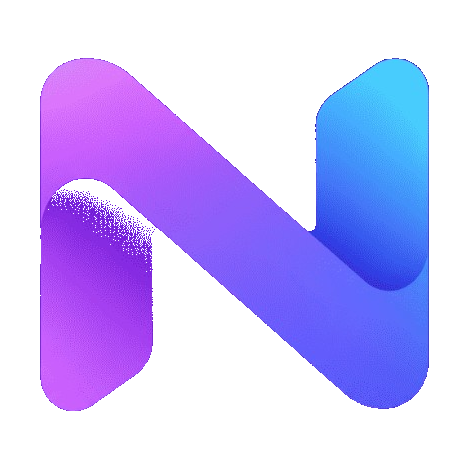
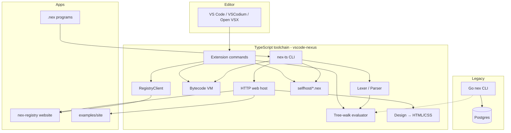

<p align="center">
  
</p>

<h1 align="center">Nex Lang</h1>

<p align="center">
  A gradually typed, expression-oriented language with a TypeScript-first toolchain,<br>
  bytecode VM, self-hosted <code>.nex</code> pipeline, design language, and upcoming package registry.
</p>

<p align="center">
  <a href="https://open-vsx.org/extension/theworker02/nex-lsp">Nex LSP (Open VSX)</a> ·
  <a href="vscode-nexus/docs/README.md">Docs</a> ·
  <a href="vscode-nexus/docs/getting-started.md">Getting started</a> ·
  <a href="vscode-nexus/docs/design/README.md">Design language</a> ·
  <a href="CHANGELOG.md">Changelog</a> ·
  <a href="docs/ROADMAP.md">Roadmap</a> ·
  <a href="SECURITY.md">Security</a> ·
  <a href="PRIVACY.md">Privacy</a> ·
  <a href="CONTRIBUTING.md">Contributing</a>
</p>

---

## Brand mark

The Nexus mark is the **ribbon N** only (magenta → purple → cyan). Wordmarks such as “Nexus” or “Package Registry” are **not** part of the image — use the mark file plus separate text in UI and docs.

| Asset | Path |
| --- | --- |
| SVG (scalable mark) | [`assets/logo.svg`](assets/logo.svg) |
| PNG (transparent mark) | [`assets/logo.png`](assets/logo.png) |
| Extension / CLI media | [`vscode-nexus/media/logo.svg`](vscode-nexus/media/logo.svg), [`logo.png`](vscode-nexus/media/logo.png), marketplace [`icon.png`](vscode-nexus/media/icon.png) |
| Language site static | [`vscode-nexus/examples/site/web/static/img/`](vscode-nexus/examples/site/web/static/img/) (bundled; no registry needed) |

---

## What Nexus is (today)

Nexus (`.nex`) is a practical language for scripting, tooling, and small web apps, with an honest bootstrap story:

- **Primary runtime:** TypeScript host under [`vscode-nexus/`](vscode-nexus/) (tree-walk evaluator + optional bytecode VM).
- **Editor:** **Nex LSP** — install from [Open VSX](https://open-vsx.org/extension/theworker02/nex-lsp) (`theworker02.nex-lsp`) for VS Code / VSCodium; also built from this package.
- **Self-hosting:** Lexer / parser / evaluator written in `.nex` under [`vscode-nexus/selfhost/`](vscode-nexus/selfhost/), loaded by the TS host.
- **Design language:** Declarative UI themes + layout in `.nex` → real HTML/CSS via host builtins.
- **Language site:** Design-authored homepage + docs landing via `npm run site` / `npm run build:site` (GitHub Pages).
- **Packages:** `nexus.toml` + publish/install client; optional **local** sibling `nex-registry` for package-hub demos (not published with this repo).
- **Legacy Go CLI:** Still in this monorepo (`cmd/nex`, `pkg/*`) for some Go-only features (notably `try`).

Host builtins (filesystem, HTTP, crypto, DB adapters, etc.) are **not** pure `.nex` — every language needs a native substrate. Self-hosting shrinks that substrate; it does not eliminate it. See [Self-hosting](vscode-nexus/docs/selfhosting.md).

---

## Quick start (TypeScript-first)

```powershell
cd vscode-nexus
npm install
npm run compile

# Run programs
node out/cli.js run .\examples\modules_demo.nex
node out/cli.js run .\examples\vm_demo.nex --vm
node out/cli.js selfhost .\examples\selfhost_demo.nex

# REPL + tests
npm run repl
npm run test:nex

# Language homepage (self-contained — no registry)
npm run site
# → http://localhost:8090

# Static export for GitHub Pages
npm run build:site
# → ../site/
```

**Website:** [https://theworker02.github.io/nex-lang/](https://theworker02.github.io/nex-lang/) (GitHub Pages)

CLI entry after compile: `vscode-nexus/out/cli.js` (`nex-ts`). Full command list: `node out/cli.js help`.

### Optional local registry

A private sibling checkout of `nex-registry` can be served with `npm run registry` for package-hub demos. It is **not** part of this GitHub repository.

---

## Monorepo map

```text
nex-lang/
├── assets/                 # Brand mark (logo.svg / logo.png) — mark only
├── vscode-nexus/           # ★ Primary TS toolchain + VS Code extension + docs
│   ├── src/language/       # Lexer, parser, evaluator, builtins, diagnostics
│   ├── src/vm/             # Bytecode compiler + stack VM
│   ├── src/compiler/       # Multi-tier engine + WASM/LLVM text codegen
│   ├── src/host/           # HTTP host, templates, design→HTML, memory DB
│   ├── src/registry/       # Package publish/install client
│   ├── src/cli.ts          # run / repl / test / selfhost
│   ├── selfhost/           # .nex lexer / parser / evaluator
│   ├── stdlib/             # Importable .nex modules (incl. design.nex)
│   ├── media/              # Extension icons + logo
│   ├── docs/               # Language & toolchain documentation
│   ├── examples/           # Demos (+ examples/site design demo)
│   └── tests/              # *_test.nex
├── packages/sdk/           # TypeScript registry control client (`@theworker02/nex-sdk`)
├── cmd/nex, pkg/*          # Legacy Go CLI / host
├── stdlib/                 # Shared .nex modules (mirrored in vscode-nexus/stdlib)
├── examples/, tests/       # Shared demos / tests at repo root
├── docs/                   # Spec + roadmap (TS docs live under vscode-nexus/docs)
├── storage/                # Local artifact / seed storage (when used)
└── bin/                    # Built Go binaries (optional)
```

Optional local sibling (not published): **`nex-registry/`** — package registry web app for demos. Served by `npm run registry` from `vscode-nexus` when checked out beside this repo. Control it from TypeScript with [`packages/sdk`](packages/sdk) (`@theworker02/nex-sdk`).

---

## Architecture



### Engine tiers

| Tier | Command / setting | What it runs | Limits (honest) |
| --- | --- | --- | --- |
| `eval` (default) | `run`, `nexus.executionEngine=eval` | Full tree-walk + modules + host builtins + HTTP | Preferred for apps / registry |
| `vm` | `run --vm`, Run File (Bytecode VM) | Core language on stack VM | **No `import`**, no web-host builtins |
| `selfhost` | `selfhost` | `.nex` lex→parse→eval | Deliberate subset (see selfhost docs) |
| `wasm` / `llvm` / `native` | Editor compile commands | Emit `.wat` / `.ll` (+ native notes) | Core subset only — not a full AOT product |

---

## Language overview (implemented surface)

Documented in depth under [`vscode-nexus/docs/language/`](vscode-nexus/docs/language/overview.md). Highlights:

- `let`, functions / closures, `if` / `while` / `for`, `break` / `continue`
- Gradual type annotations
- Arrays, hashes, indexing / members
- `struct` / `enum`, `match` (`->` / `=>`)
- Pipes `|>`, Results `ok` / `err` / `unwrap` (TS path; `try` early-return is **Go-only**)
- Modules: `import "strings";` with resolution across relative paths, `.modules/`, `stdlib/`
- English-ish sugar lowered by the parser (string-safe `and` / `or` / `not`)
- Experimental / partial: effects, regions, macros, async/spawn/chan — not production guarantees

---

## Design language

Nexus doubles as a **design language**: themes, layout, forms, and chrome authored in `.nex` and rendered to HTML/CSS.

- Spec & API: [`vscode-nexus/docs/design/README.md`](vscode-nexus/docs/design/README.md)
- Authoring walkthrough: [`vscode-nexus/docs/design/guide.md`](vscode-nexus/docs/design/guide.md)
- Stdlib: `import "design"` (`stdlib/design.nex`)
- Host builtins: `design_document`, `design_response`, `design_render`, `design_css`, `html_doc`
- Brand chrome: `brand` / `brand_link` take a **mark URL** (image) plus separate name/tag text — the mark file has no wordmark baked in

```powershell
cd vscode-nexus
npm run site         # live language site → http://localhost:8090
npm run build:site   # static export → ../site/ (GitHub Pages artifact)
```

Public Pages URL: [https://theworker02.github.io/nex-lang/](https://theworker02.github.io/nex-lang/)

---

## Editor extension — Nex LSP (Open VSX)

**Install:** [Nex LSP on Open VSX](https://open-vsx.org/extension/theworker02/nex-lsp) — extension id `theworker02.nex-lsp`.

Works with VS Code, VSCodium, and other Open VSX–compatible editors. Display name **Nex LSP** · icon: ribbon N mark (`vscode-nexus/media/logo-256.png`).

```powershell
cd vscode-nexus
npm run compile
npm run package          # builds nex-lsp-*.vsix (local / sideload install)
# optional local Open VSX publish (needs token):
# npx ovsx publish *.vsix --pat $env:OVSX_PAT
```

CI publishes **Nex LSP** to Open VSX on **GitHub Release** (or `workflow_dispatch` with confirm=`publish`) via [`.github/workflows/openvsx.yml`](.github/workflows/openvsx.yml).

**Configure later (maintainers):** add repository secret `OVSX_PAT` — create a token at [open-vsx.org/user-settings/tokens](https://open-vsx.org/user-settings/tokens) and store it under GitHub → Settings → Secrets. Until that secret is set, CI still packages the VSIX but skips the publish step. You do not need `OVSX_PAT` to develop or contribute.

---

## Funding / Sponsors

- **thanks.dev:** [https://thanks.dev/u/gh/theworker02](https://thanks.dev/u/gh/theworker02) (GitHub user `theworker02`)
- **GitHub Sponsors:** [`theworker02`](https://github.com/sponsors/theworker02)

Configured in [`.github/FUNDING.yml`](.github/FUNDING.yml) (`github` + `thanks_dev`).

---

## Optional local package registry

```powershell
cd vscode-nexus
npm run compile
npm run registry   # requires sibling ../nex-registry — not published with nex-lang
```

| Mode | How | Notes |
| --- | --- | --- |
| TS host + memory DB | `npm run registry` (default) | Demo DB seeded from `STORAGE_DIR` |
| TS host + `DATABASE_URL` | Env set | Uses Postgres via `pg` when the URL is reachable; falls back to memory on failure |

Package client docs: [`vscode-nexus/docs/packages.md`](vscode-nexus/docs/packages.md).

---

## Documentation index

| Doc | Topic |
| --- | --- |
| [vscode-nexus/docs/README.md](vscode-nexus/docs/README.md) | **Primary docs hub** |
| [Getting started](vscode-nexus/docs/getting-started.md) | Install, run, REPL, tests, editor |
| [Language overview](vscode-nexus/docs/language/overview.md) | What Nexus is today |
| [Syntax](vscode-nexus/docs/language/syntax.md) · [Types](vscode-nexus/docs/language/types.md) · [Control](vscode-nexus/docs/language/control-flow.md) · [Functions](vscode-nexus/docs/language/functions.md) · [Modules](vscode-nexus/docs/language/modules.md) · [Match](vscode-nexus/docs/language/match.md) | Language reference |
| [Builtins](vscode-nexus/docs/builtins.md) · [Stdlib](vscode-nexus/docs/stdlib.md) | Runtime surface |
| [Toolchain](vscode-nexus/docs/toolchain.md) | Engines, CLI, WASM/LLVM, settings |
| [Self-hosting](vscode-nexus/docs/selfhosting.md) | Bootstrap status & subset |
| [Packages](vscode-nexus/docs/packages.md) · [Website apps](vscode-nexus/docs/website.md) | Registry & HTTP |
| [Design language](vscode-nexus/docs/design/README.md) | Themes → HTML/CSS |
| [Examples](vscode-nexus/docs/examples.md) | Demo index |
| [Language site / Pages](vscode-nexus/docs/site.md) | Self-host homepage + GitHub Pages |
| [SECURITY.md](SECURITY.md) · [PRIVACY.md](PRIVACY.md) · [TERMS.md](TERMS.md) | Trust / legal |
| [CODE_OF_CONDUCT.md](CODE_OF_CONDUCT.md) · [CONTRIBUTING.md](CONTRIBUTING.md) · [SUPPORT.md](SUPPORT.md) | Community |
| [docs/spec.md](docs/spec.md) | Implemented surface (TS-first) |
| [docs/ROADMAP.md](docs/ROADMAP.md) | Near-term priorities |

```bash
cd vscode-nexus && npm run docs   # prints absolute path to docs/
```

---

## Examples

| Location | Contents |
| --- | --- |
| `vscode-nexus/examples/` | Modules, VM, selfhost, language demos |
| `vscode-nexus/examples/site/` | Language homepage (`npm run site` / `npm run build:site`) |
| `examples/` | Shared root demos (also usable from Go CLI) |
| `tests/` · `vscode-nexus/tests/` | `*_test.nex` / language tests |

---

## Contributing

See [`CONTRIBUTING.md`](CONTRIBUTING.md) for setup, PR expectations, and maintainer notes (including optional Open VSX `OVSX_PAT`). Quick outline:

1. Prefer changes in **`vscode-nexus/`** (TS is the supported path).
2. `npm install && npm run compile && npm run smoke && npm run test:nex`
3. Keep docs honest — document implemented behavior; call out subsets and stubs.
4. Follow the [Code of Conduct](CODE_OF_CONDUCT.md). Questions: [SUPPORT.md](SUPPORT.md).

---

## Trust & legal

| Doc | Purpose |
| --- | --- |
| [SECURITY.md](SECURITY.md) | Vulnerability reporting |
| [PRIVACY.md](PRIVACY.md) | Privacy policy (local CLI/extension + static Pages) |
| [TERMS.md](TERMS.md) | Terms of use (MIT / as-is) |
| [CODE_OF_CONDUCT.md](CODE_OF_CONDUCT.md) | Community standards |
| [SUPPORT.md](SUPPORT.md) | Where to ask for help |
| [LICENSE](LICENSE) | MIT |

Site mirrors: [/privacy](https://theworker02.github.io/nex-lang/privacy/), [/security](https://theworker02.github.io/nex-lang/security/), [/terms](https://theworker02.github.io/nex-lang/terms/), [/conduct](https://theworker02.github.io/nex-lang/conduct/).

---

## License

MIT — see [`LICENSE`](LICENSE).
